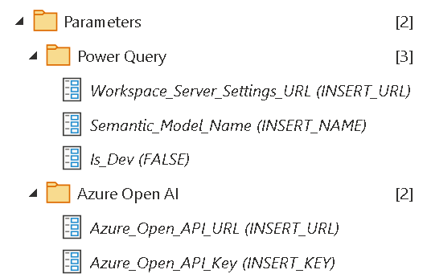
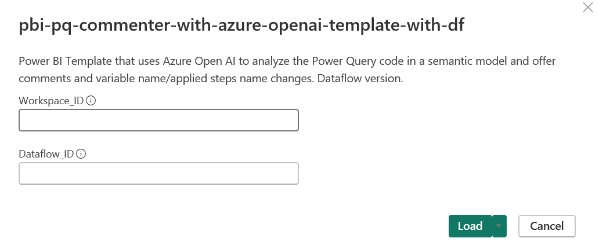

# pbi-pq-commenter-with-azure-openai
Power BI Template that uses Azure Open AI to analyze the Power Query code in a semantic model and offer comments and variable name/applied steps name changes.

***Important Note #1**: This guide is customized to Power BI for the Commercial environment.*

***Important Note #2**: This guide uses scripts that I built and tested on environments I have access to. Please review all scripts if you plan for production use, as you are ultimately responsible for the code that runs in your environment.*

## Table of Contents

- [pbi-pq-commenter-with-azure-openai](#pbi-pq-commenter-with-azure-openai)
  - [Table of Contents](#table-of-contents)
  - [Installation](#installation)
    - [Prerequisites](#prerequisites)
      - [Power BI](#power-bi)
      - [Desktop](#desktop)
      - [Azure OpenAI](#azure-openai)
- [Install Dataflow Version](#install-dataflow-version)
  - [Report Overview](#report-overview)
  - [Security](#security)

## Installation

### Prerequisites

#### Power BI
-   Power BI Premium Per User, Premium, or Fabric workspace. If you do not have a Premium Per User license, use the "Buy Now" feature on <a href="https://docs.microsoft.com/en-us/power-bi/admin/service-premium-per-user-faq" target="_blank">Microsoft's site</a> or if you don't have access to do that, please contact your administrator (be nice!).

#### Desktop

-   Power BI Desktop installed.

#### Azure OpenAI

-   A ChatGPT 4.0 model deployed.  Instructions can be followed [at this link](https://learn.microsoft.com/en-us/azure/ai-services/openai/how-to/create-resource?pivots=web-portal).

# Install Dataflow Version

If you want to have this run in the service, it's better to run this as a dataflow to avoid any privacy and data combining issues.  To use the dataflow version please follow these steps:

1. Identify the Workspace Connection for your workspace by following [these instructions](https://learn.microsoft.com/en-us/power-bi/enterprise/service-premium-connect-tools).  In workspace settings, it's at the bottom of the Premium tab (see Figure 1).

2. Download the latest release of the dataflow template file.

3. Import the dataflow into your workspace as [instructed by Microsoft](https://learn.microsoft.com/en-us/power-bi/transform-model/dataflows/dataflows-create#create-a-dataflow-by-using-importexport)

4. Open the dataflow.

5. Update the dataflow parameters (shown in Figure 8):

    - Workspace_Server_Settings_URL - This is retrieved in Step 1.
    - Semantic Model Name - This is the name of the dataset/semantic model in the workspace
    -  Azure_Open_API_URL - This can be retrieved during the deployment of the ChatGPT 4.0 model in the [prerequisites](#prerequisities). For example, if the name of my OpenAI instance is "ABC" and the ChatGPT deployment is named "XYZ" here is the sample URL: *https://XYZ.openai.azure.com/openai/deployments/ABC/chat/completions?api-version=2024-02-01*
    - Azure_Open_API_Key - This can be also be retrieved during the deployment of the ChatGPT 4.0 model in [prerequisites](#prerequisities). **Please read the section on [security](#security) prior to sharing this file with anyone**.

 *Figure 7 - Screenshot of paramters to update in the dataflow.*

6. Click on the table labeled "Power Query Code". You should be prompted to allow Native Database Queries (example in Figure 8).  Select the "Continue" button.

*Figure 8 - Screenshot to Allow Native Database Queries.*

7. You then will be prompted to configure the connection for Analysis Services. This allows the template to query the dynamic management views in the Power BI Service. Select the "Configure Connection" button and login with your Microsoft account.

*Figure 9 - Screenshot to connect to Analysis Services.*

8. Click on the table labled "Power Query Code Transformed". You should be prompted to configure the Web Source connection. This allows the template to query Azure OpenAI.  Select the "Configure Connection" button and connect anonymously.

*Figure 10 - Screenshot to connect to Web source.*

9. Save the dataflow and refresh it.

10. Capture the workspace ID and dataflow ID in your browser's URL (see Figure 11 as an example)

*Figure 11 - Example of Workspace and Dataflow ID in the URL.*

11. Download and open the latest report template labeled "pbi-pq-commenter-with-azure-openai-template-with-df.pbit"

12. You will be prompted to enter the following:

- Workspace_ID - This is retrieved in Step 10.
- Dataflow_ID - This is retrieved in Step 10.

*Figure 12 - Template popup for parameters.*

Press the load button when you have finished.

13. Once the refresh has completed you should see report.

## Report Overview

The report has 4 main features as identified in Figure 14.

*Figure 14 - Screenshot of report with main features identified.*

1. Select Table - You can filter which table you wish to view the existing Power Query code and the comments or variables/applied steps renaming.

2. Enhancement Options - You can choose between just seeing what ChatGPT has offered for comments or see comments and variable/applied steps renaming.

3. This is the existing Power Query code for the selected table.

4. This is the proposed changes provided by ChatGPT based on your selection in Enhancement Options.

You can use the "Copy Value" option to copy the transformed Power Query code to your semantic model.  Please be sure to properly test your code.

## Security

I tried to provide this template as a low barrier to entry, so in this case the API Key is stored as a parameter.  Please make sure not to share your pbix or pbip implementation with other folks, nor provide them access to the parameters of the semantic model in the service if they shouldn't access that key.

This is an issue with Web.Contents only allowing Anonymous connections with when issuing a POST HTTP Request to an API.  If you try to do [this approach](https://learn.microsoft.com/en-us/powerquery-m/web-contents#example-3) with Web.Contents  you'll get this error: "Web.Contents with the Content option is only supported when connecting anonymously".
